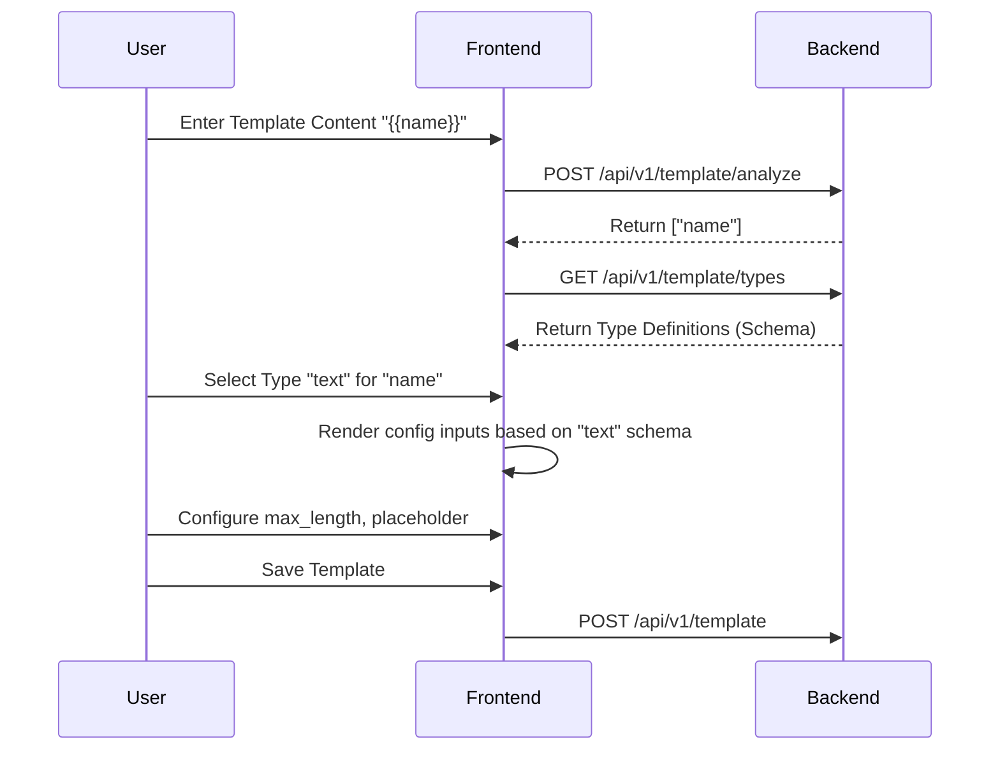
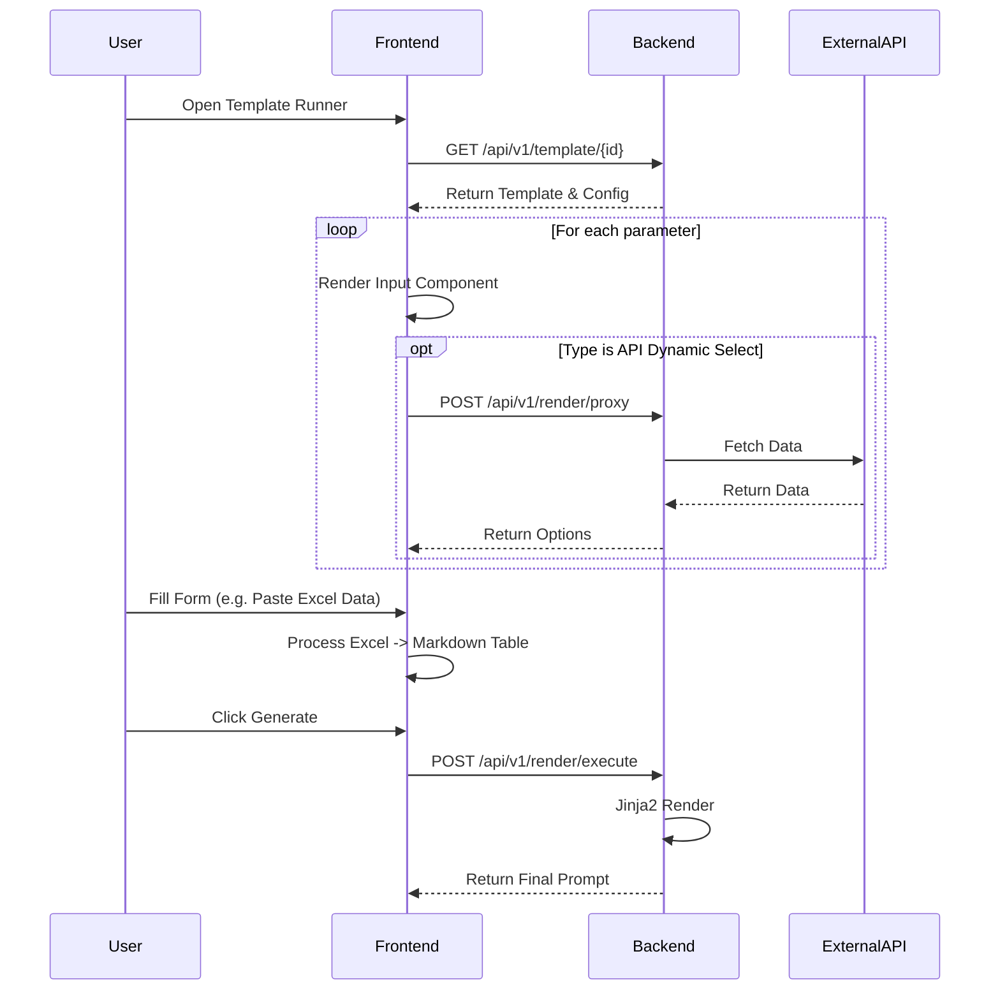

# Dynamic Prompt Template Configuration System

This project implements a flexible Prompt Template Configuration system allowing users to create templates with dynamic parameters, configure their properties (metadata-driven), and render final prompts using a Vue.js frontend and Flask backend.

## 1. Code Structure

```
.
├── backend/
│   ├── app/
│   │   ├── __init__.py      # Flask app factory
│   │   ├── extensions.py    # db (SQLAlchemy) instance
│   │   ├── models.py        # Database models (PromptCustomTemplate)
│   │   ├── routes.py        # API endpoints
│   │   └── template_types.py # Parameter type definitions (Registry)
│   ├── run.py               # Entry point
│   └── requirements.txt
└── frontend/
    ├── src/
    │   ├── views/
    │   │   ├── TemplateList.vue   # List of templates
    │   │   ├── TemplateEditor.vue # Create/Edit templates (Dynamic Form)
    │   │   └── TemplateRunner.vue # Use/Fill templates
    │   ├── App.vue
    │   └── main.js
    └── vite.config.js       # Vite config (Proxy to backend)
```

## 2. Functional Description

*   **Template Creation**: Users can define templates with Jinja2 syntax (e.g., `{{variable}}`).
*   **Variable Analysis**: The backend automatically parses the template to find variables.
*   **Parameter Configuration**: Users configure each variable's type (Text, Select, API Dynamic Select, KB Search, Excel).
    *   **Metadata-Driven**: The frontend renders configuration fields based on the backend's `extension_schema` for each type.
*   **Dynamic Rendering**:
    *   **API Dynamic Select**: Proxies requests through the backend to fetch external options.
    *   **Excel Input**: Allows pasting tab-separated values from Excel, which are automatically converted to a Markdown table.
*   **Execution**: Fills the template with user inputs and renders the final string.

## 3. Logic Flow

### Configuration Phase



### Usage Phase



## 4. Startup Instructions

### Prerequisites
*   Python 3.8+
*   Node.js 16+

### Start Backend

```bash
cd backend
pip install -r requirements.txt
python run.py
# Server runs at http://127.0.0.1:5000
```

### Start Frontend

```bash
cd frontend
npm install
npm run dev
# App runs at http://127.0.0.1:5173
```

## 5. API List

| Method | Path | Description |
| :--- | :--- | :--- |
| **GET** | `/api/v1/template/types` | Get all supported parameter types and their configuration schemas. |
| **POST** | `/api/v1/template/analyze` | Parse a template string and return a list of variables. |
| **POST** | `/api/v1/template` | Create a new template. |
| **GET** | `/api/v1/template/list` | List templates (paginated). |
| **GET** | `/api/v1/template/<id>` | Get template details. |
| **PUT** | `/api/v1/template/<id>` | Update a template. |
| **DELETE** | `/api/v1/template/<id>` | Delete a template. |
| **POST** | `/api/v1/render/proxy` | Proxy request to external APIs (avoids CORS for dynamic selects). |
| **POST** | `/api/v1/render/execute` | Render a template with provided parameter values. |
